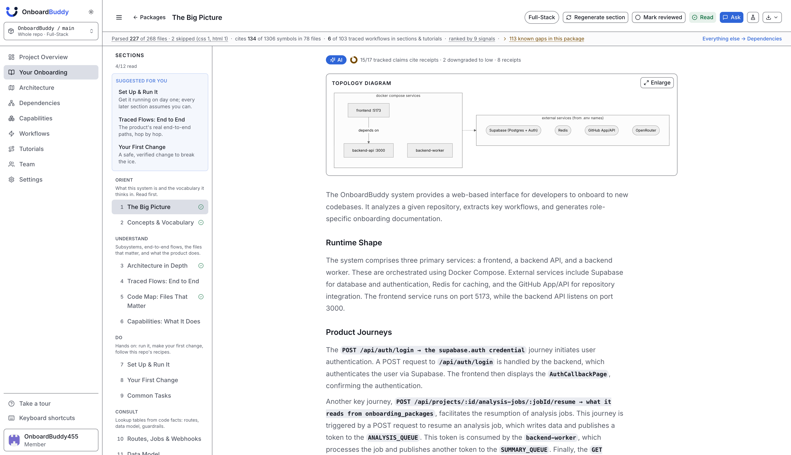
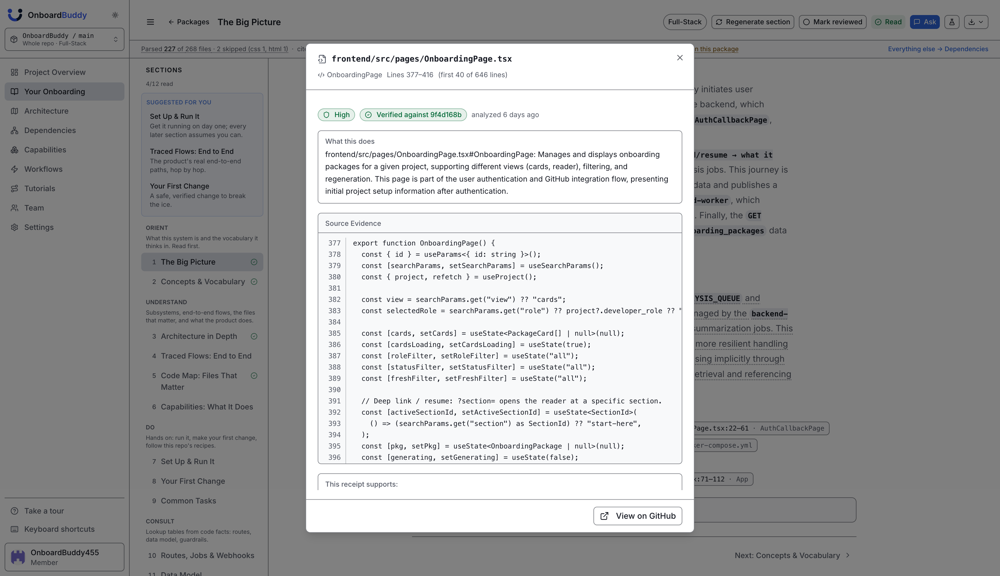
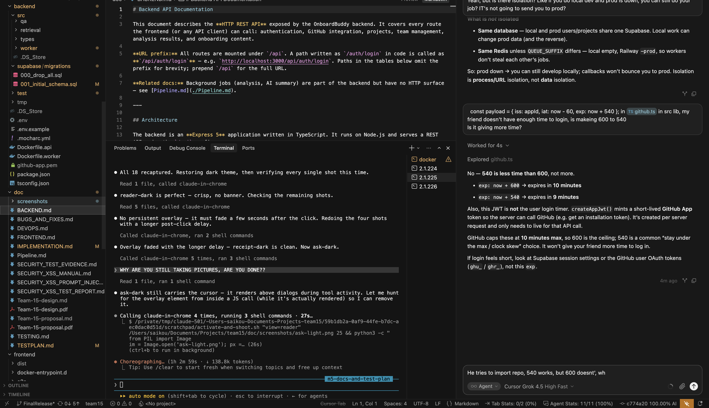
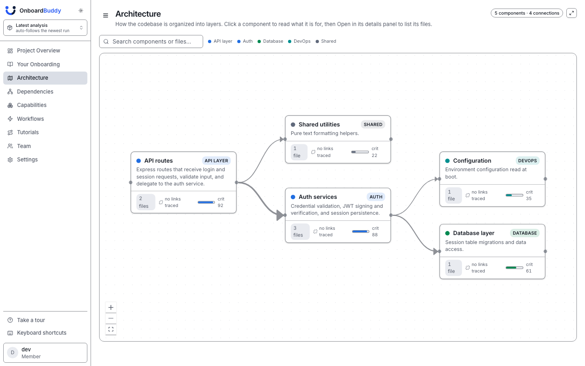
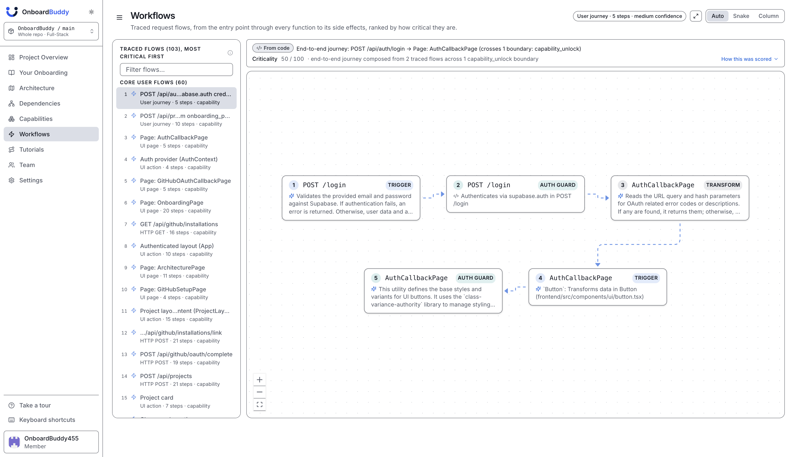
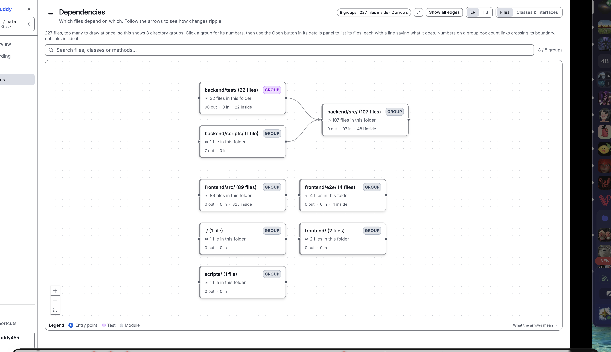
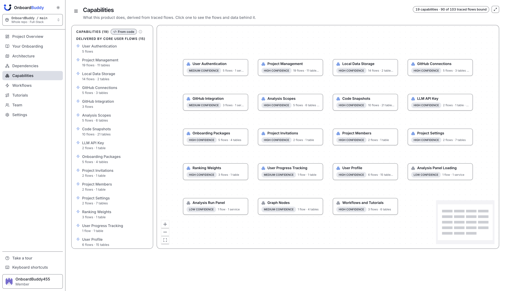
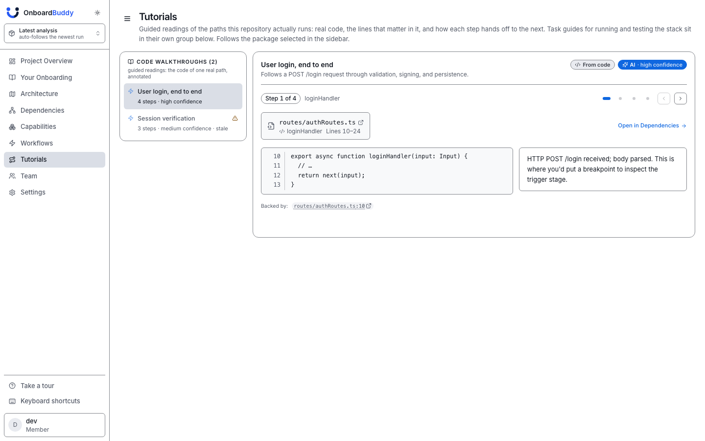
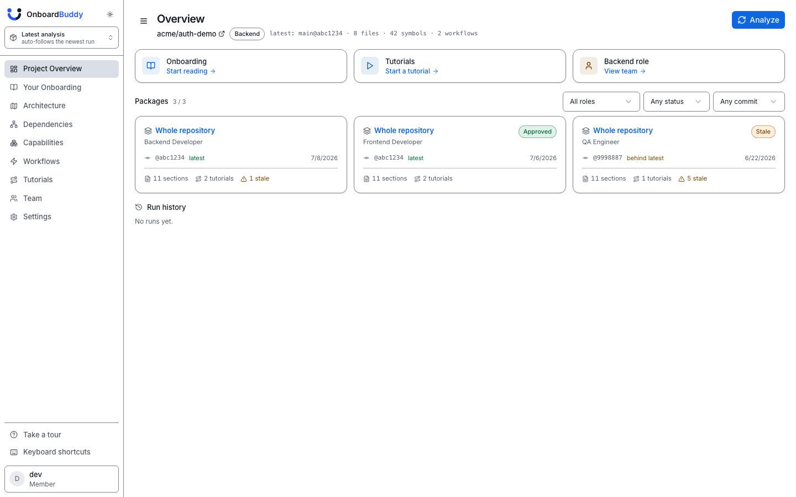

# OnboardBuddy

Point OnboardBuddy at a GitHub repository and it writes the onboarding handbook for it: architecture,
traced workflows, guided walkthroughs and four interactive maps, with every claim cited to the file
and lines it came from. Deterministic first, AI second, receipts always.

**Live:** https://onboardbuddy.dev · **Run it locally:** [instructions](#run-it-locally) · **Docs:** [doc/](#documentation) · **Manual test plan:** [doc/TESTPLAN.md](doc/TESTPLAN.md)

## What it is

OnboardBuddy is a codebase onboarding platform that helps a developer get productive in an
unfamiliar codebase. Point it at a GitHub repository and it produces an **onboarding handbook** for
that repository: what the system does, how it is put together, the flows that matter, and what to do
on day one, with every claim linked back to the exact file and lines it came from, so nothing has to
be taken on trust. It is deliberately not company, HR or culture onboarding; the scope is helping a
developer understand one specific codebase faster.

What makes it different from asking an AI to summarise a repo is the order of operations. The
structure is **extracted from the code first** (entry points, call flows, data model, dependencies,
what matters most), and AI is only used to explain structure that has already been verified.
Reference material is generated straight from code facts, and generated prose is checked against its
own citations before it ships. Teams that prefer no AI at all can turn it off and still get a
complete document.

Results are versioned per commit. Re-analysing after a push only re-does what actually changed and
marks the affected sections stale rather than silently rewriting them, so a team onboarding people
months apart is reading the same document, not two different ones.

## How it works

Three rules shape everything the product does:

1. **Extract first, explain second.** Repository structure (entry points, call graphs, data model,
   dependencies, what matters most) is extracted deterministically with the TypeScript Compiler API.
   AI is only asked to explain structure that already exists; with AI disabled the handbook is still
   complete, built from code facts alone.
2. **Every claim carries a receipt.** Each statement links to the file and line range it came from,
   pinned to the analysed commit, and each section is re-checked against its own citations before it
   ships. Confidence labels state their reason, and what could not be verified is listed instead of
   dropped.
3. **Results are versioned per commit.** Re-analysis is incremental: only what changed is re-done,
   and the sections it affects are marked stale rather than rewritten silently.

The pipeline, end to end:

> GitHub import → TypeScript Compiler API evidence extraction → call-graph workflow extraction →
> two-phase criticality ranking → role-based, receipt-cited handbook → citation validation →
> incremental re-analysis with staleness

Architecture at a glance: three processes (a React single-page app, an Express API, and a BullMQ
analysis worker that scales horizontally) and four cloud services (Supabase for Postgres, pgvector
and auth; Upstash Redis for the queue; a GitHub App for read-only repository access and push
webhooks; OpenRouter for AI, restricted to providers that do not retain data). Phase-by-phase detail,
the data model and the guardrails are in [doc/Pipeline.md](doc/Pipeline.md).

## Features

The core loop: import a repository, let the analysis run, then read. Everything you read can be
audited back to code. Every screenshot below is the live app analyzing **its own repository** (no
mocked data), and follows your light/dark preference.

### 1. The onboarding handbook

Twelve sections in four chapters: *Orient* (what this system is and its vocabulary), *Understand*
(subsystems, traced flows, the files that matter), *Do* (set up and run it, make your first change,
this repo's common tasks), *Consult* (lookup tables for routes, data model and operational
guardrails). Each section opens with a TL;DR; a "Suggested for you" rail keeps track of what to read
next; the Consult tables are generated deterministically from code facts, so routes and columns are
exact. The same analysis reads differently by role: a backend developer sees routes, services and
database writes first; a frontend developer sees pages, components and API clients; DevOps sees CI,
Docker and configuration; QA sees tests and critical flows. Owners approve content before it is
shared, each member tracks their own reading progress, and **Export** downloads the whole handbook
as Markdown.

<picture>
  <source media="(prefers-color-scheme: dark)" srcset="doc/screenshots/reader-dark.png">
  
</picture>

### 2. Every claim is auditable: receipts, confidence, and Ask

The product's core promise is that every statement is backed by code, and the reader makes that
checkable rather than asserted. Citation chips sit at the claim they support; clicking one opens the
file, the line range, the code itself, and a **View on GitHub** link pinned to the analysed commit.
Each section shows how much of it is receipt-backed, why its confidence is what it is, and lists
what could not be verified as a known unknown instead of quietly dropping it. The **Ask** panel
answers free-form questions about the repository under the same rules: answers cite receipts, and
an unsupported answer is flagged rather than asserted.

<picture>
  <source media="(prefers-color-scheme: dark)" srcset="doc/screenshots/receipt-dark.png">
  
</picture>

<picture>
  <source media="(prefers-color-scheme: dark)" srcset="doc/screenshots/ask-dark.png">
  
</picture>

### 3. Four interactive maps

*Architecture* (subsystem clusters and how critical each is), *Dependencies* (searchable file and
class map), *Workflows* (traced flows and end-to-end product journeys), and *Capabilities* (what the
product does, linked to the code that delivers it). Every node opens its underlying evidence;
criticality scores explain themselves signal by signal rather than presenting a bare number.

<picture>
  <source media="(prefers-color-scheme: dark)" srcset="doc/screenshots/architecture-dark.png">
  
</picture>

<picture>
  <source media="(prefers-color-scheme: dark)" srcset="doc/screenshots/workflows-dark.png">
  
</picture>

<picture>
  <source media="(prefers-color-scheme: dark)" srcset="doc/screenshots/dependencies-dark.png">
  
</picture>

<picture>
  <source media="(prefers-color-scheme: dark)" srcset="doc/screenshots/capabilities-dark.png">
  
</picture>

### 4. Guided walkthroughs

Step-by-step traces through the flows that matter, each stop pairing real code with an explanation
and receipts that deep-link to the exact lines on GitHub. Walkthroughs are generated from traced
call graphs, so the steps are the path a request actually takes, not a narrative reconstruction.

<picture>
  <source media="(prefers-color-scheme: dark)" srcset="doc/screenshots/tutorials-dark.png">
  
</picture>

### 5. Analysis you can watch, budget, and keep fresh

A project holds many analyses at once (different branches, commits and sub-directories), and each
team member chooses which one they read, behind three permission tiers (owner, admin, developer).
Before spending anything, **Preview first** shows file counts, estimated AI calls and a cost tier;
during a run, a stage-labelled progress bar and live activity feed show exactly what is happening,
with pause/stop/resume; afterwards, **Run history** records every run's configuration, duration and
cost. Re-analysing a new commit only re-does what changed and marks affected sections stale instead
of rewriting them. With **Re-analyze on push** enabled, that happens automatically when the
repository changes (webhook delivery needs a publicly reachable instance, since GitHub cannot reach
`localhost`; see [Known limits](#known-limits)), and an opt-in **auto-regenerate stale sections**
setting rebuilds what a push staled, so a repository that changes overnight can have an up-to-date
handbook by morning. That setting is off by default because it is the only one that spends AI budget
unattended. Privacy is a first-class setting: three modes including fully AI-disabled (which still
produces a complete document from code facts), per-project API keys, spend budgets with a stop
switch, and AI routing restricted to providers that do not retain data. A cold analysis of a
2.3M-token repository takes about 4–5 minutes and costs about $0.35.

<picture>
  <source media="(prefers-color-scheme: dark)" srcset="doc/screenshots/overview-dark.png">
  
</picture>

## What it can analyse

**Code is TypeScript and JavaScript**: those are the two languages parsed all the way down into
symbols, call graphs and dependencies. Everything else a repository contains is still read, classified
and used as evidence; it just is not parsed into a call graph.

| | Formats | What we do with them |
|---|---|---|
| **Parsed into symbols** | TypeScript (`.ts`, `.tsx`), JavaScript (`.js`, `.jsx`, `.mjs`, `.cjs`) | Full analysis: symbols, signatures, imports/exports, call graph, entry points, side effects, ranking |
| **Documentation** | Markdown (`.md`, `.mdx`), reStructuredText (`.rst`), plain text (`.txt`), `LICENSE`, anything under `docs/` | Read as evidence, citable in the handbook, and compared against the code to flag documentation that has drifted |
| **Configuration** | JSON, YAML, TOML, XML, Dockerfile, Docker Compose, GitHub Actions workflows, `.env.example`, `tsconfig`, and the usual build/lint/test configs | Read as its own layer: this is where the dev, test and CI paths come from, and the environment-variable reference |
| **Data model** | SQL (including migrations), Prisma schemas, `schema.json` | Tables and their foreign-key relationships, used to build the data-model reference |
| **Scripts** | Shell (`.sh`, `.bash`, `.zsh`), PowerShell (`.ps1`) | Read as evidence for the operational commands a developer needs |
| **Recognised, not parsed** | Python, Go, Ruby, Java, Kotlin, C#, PHP, Rust, Swift, Scala, C, C++, Vue, Svelte, HTML, CSS/SCSS/LESS | Counted and reported. The cost preview tells you up front how much of the repository we cannot parse, rather than quietly analysing a fraction of it |
| **Assets** | Images, fonts, archives, media, PDFs | Inventoried and hashed for change detection; contents never read |

**What it finds, not just what it reads.** Parsing a file is only half the job; the other half is
recognising where a system's work actually happens. Entry points are detected across the shapes real
repositories take (HTTP routes, UI actions that reach an effect, socket and event handlers, queue
consumers, CLI commands, and a package's public API), and effects are counted whether they go through
an ORM, a document store, a client SDK, a cache, a queue, browser storage or the filesystem. This
matters because a study app whose features live in React components calling a database directly, or a
game whose protocol is socket events, has no HTTP surface to find: an analyser that only understands
request handlers reports such a repository as doing almost nothing.

In total the classifier knows **29 languages and formats across 42 file extensions**. The honest
summary: a mixed TypeScript repository is analysed properly end to end, a repository whose core logic
is in another language will produce a documentation-and-configuration-level handbook and say so.

Adding a second parsed language is a deliberate non-goal for this project: the parser sits behind an
interface so it is possible, but we would rather ship one language well.

## Status

### What is shipped

| Capability | What it does today |
|---|---|
| **Role-based onboarding handbook + AST parser** | GitHub App import, TypeScript Compiler API evidence extraction (symbols, calls, side effects, entrypoints, docs/config/schema), 12-section chaptered handbook with per-claim receipts, five roles generated on demand from one analysis |
| **Architecture map, dependency graph, graph visualiser** | Four maps (Architecture, Dependencies + classes, Workflows, Capabilities), clustered and capped for readability, receipts on every node |
| **Workflow extraction + walkthrough generation** | Call-graph tracing from entrypoints (routes, UI actions, jobs, sockets, CLI, public API) to side effects; tutorials pair each step with real code, an explanation and receipts |
| **Critical path identification (the "Critical 25%")** | Two-phase ranking: deterministic composite scoring gated, then LLM-blended multi-view scores; per-role projections with explainable reasons and user-editable weights |
| **Incremental re-analysis** | File/symbol AST diff, evidence-hash invalidation (whitespace-only edits invalidate nothing), stale badges, per-section regeneration, plus automatic re-analysis on push via the GitHub webhook (needs a publicly reachable instance; see [Known limits](#known-limits)) |
| **Grounded Ask** | Free-form questions over the handbook and its receipts; every answer cites receipts, unsupported answers are flagged, and the route is rate-limited |

Around that core: authentication (email or GitHub), repository import with branch selection, a
dashboard, project CRUD, invitations with decline, leave and ownership transfer, three permission
tiers, a role selector, settings, live run status, Markdown export, owner review controls, and
snapshot history.

### Deployment

The same build runs three ways: the live instance (frontend on Vercel at https://onboardbuddy.dev;
API and worker on Railway), local Docker Compose, or your own hosting. One frontend image reads its
API origin, Supabase URL and Content-Security-Policy at container start, so nothing is baked in at
build time and the same image serves local Docker and the cloud. Setup is documented in
[doc/DEVOPS.md](doc/DEVOPS.md).

### Known limits

Each of these is surfaced in the product rather than hidden:

- **One parsed language.** TypeScript/JavaScript is parsed to symbol level; everything else is read
  and cited but not call-graphed, and the import preview says how much of a repository that leaves
  unparsed (see [What it can analyse](#what-it-can-analyse)).
- **Re-analyse on push needs a publicly reachable instance.** GitHub cannot deliver webhooks to
  `localhost`, so on a plain local install the endpoint answers 503 (off without a secret) unless you
  expose it through a tunnel ([doc/DEVOPS.md](doc/DEVOPS.md), "GitHub App webhook"). Everything else
  behaves identically locally and in production.
- **AI narration is thin where evidence is thin.** Structural descriptions always exist, and the UI
  labels which text is which.
- **A repository with no traceable effects** (a static content site, say) honestly produces no
  workflows, so those tabs are legitimately empty for that shape of project.
- **Invitations are in-app only.** No email is sent (no mail provider is provisioned); the invite
  dialog says so and offers a share-a-link path instead of pretending an email went out.

### Deliberately not built

| Not built | What covers it | Why |
|---|---|---|
| Invitation email delivery | In-app invitations plus a shareable link | Needs a mail provider that was never provisioned; the dialog says so |
| Zip / multi-file export | Markdown export | A zip containing one file adds nothing; multi-file export has no consumer |
| Project archive (soft delete) | Hard delete with type-to-confirm | A second lifecycle state was not worth the surface area |
| A second parsed language | 29 languages/formats are still read, classified and counted honestly | One language analysed well rather than several analysed shallowly; the parser sits behind an interface, so it is possible later |
| Local Ollama / self-hosted models | Bring-your-own-key plus no-retention routing | Covers the privacy motivation without a second AI backend |
| PR comments on onboarding changes | Push-triggered re-analysis keeps the handbook fresh | Posting comments back to pull requests was not started |
| Confluence / Notion export | Markdown as the interchange format | Not started |
| VS Code extension | The web reader | Not started |
| External sources (PRs, tickets, Slack, design docs) | The code, docs and configuration in the repository itself | Not started; the web reader and the pipeline came first |

### Security and privacy

Privacy is a first-class setting: three modes including fully AI-disabled, per-project API keys,
spend budgets with a stop switch, and AI routing restricted to providers that do not retain data. On
the application side, the main attacker path (a hostile repository steering the model) is closed at
three independent layers: an untrusted-data boundary on every prompt, mechanical sanitisation of
model output before it is stored, and a Content-Security-Policy (`script-src 'self'`, plus the usual
security headers) verified in a browser against the real bundle. A generated hostile-repository
evidence report fails CI if a defence regresses. One honest caveat carries over from the assessment:
a generated onboarding handbook is not a security review of the repository it describes. The full
assessment is [doc/SECURITY_XSS_PROMPT_INJECTION.md](doc/SECURITY_XSS_PROMPT_INJECTION.md); the
generated evidence is [doc/SECURITY_TEST_EVIDENCE.md](doc/SECURITY_TEST_EVIDENCE.md).

### Tests and bugs

**Tests.** 1,440 automated tests (1,004 backend, 436 frontend) behind one command with a per-area
summary; no credentials and no running services needed:

```sh
docker compose -f docker-compose.test.yml run --rm test    # ends with a per-area pass/fail summary
```

[doc/TESTING.md](doc/TESTING.md) explains what they cover and why. [doc/TESTPLAN.md](doc/TESTPLAN.md)
is the hands-on walkthrough of every feature (about 55 minutes), on the live instance or a local
install.

**Bugs.** 85 bugs were filed over the project's life and every one is closed: none open, all P0/P1
resolved, and no bug closed Won't-Fix as a whole (seven Won't-Fix sub-items of otherwise fixed bugs
each carry a stated reason, invitation email delivery being the most visible). The per-bug record
with expected vs actual, repro steps, fix notes and verification is
[doc/BUGS_AND_FIXES.md](doc/BUGS_AND_FIXES.md); the issues themselves were tracked on a private
GitHub instance during development, so the ledger is the public record. Found something new? Open an
issue on this repository with the page, what you did, what you expected and what happened.

## Run it locally

The app runs via **Docker Compose**. Three containers start together: frontend, backend API, and
backend worker. No local Node, Postgres or Redis install is needed: Supabase, Upstash Redis, GitHub
and OpenRouter are reached as cloud services using the credentials in the `.env` files. (Prefer not
to run anything? The same build is live at https://onboardbuddy.dev.)

1. **Prerequisites.** Docker, plus your own accounts for the four cloud services: a Supabase project,
   an Upstash Redis endpoint, a GitHub App, and an OpenRouter key. Creating each one is walked
   through in [doc/DEVOPS.md](doc/DEVOPS.md), "Setup Guide".

2. **Configure.** From the repo root:

   ```sh
   cp backend/.env.example backend/.env      # API + worker: Supabase, Postgres, Redis, GitHub App, OpenRouter
   cp frontend/.env.example frontend/.env    # VITE_API_URL, VITE_SUPABASE_URL, VITE_SUPABASE_ANON_KEY
   ```

   Every variable is commented in the templates. Put the GitHub App private key at
   `backend/github-app.pem` (mounted read-only into both backend containers) or paste it into
   `GITHUB_APP_PRIVATE_KEY`. Apply the schema once from
   `backend/supabase/migrations/001_initial_schema.sql` (idempotent; `000_drop_all.sql` resets it).

   Both `.env` files must exist before you start: `docker-compose.yml` loads `backend/.env` into the
   API and worker, and `frontend/.env` into the frontend. All three containers read their
   configuration at **startup**, so editing a `.env` and re-running `docker compose up -d` is enough
   (no rebuild needed).

3. **Start it.**

   ```sh
   docker compose up --build
   ```

   First build takes a few minutes. When it is up you should see `OnboardBuddy API listening on
   http://localhost:3000` from `backend-api`, and `[worker] listening on queue "analysis-…"` plus
   `[summary-worker] listening on queue "summary-…"` from `backend-worker`. (Upstash prints
   `IMPORTANT! Eviction policy is optimistic-volatile` on connect; that is a Redis-provider notice
   from BullMQ, not an error.)

4. **Access the app.**

   | Service | Container | URL |
   | ------- | --------- | --- |
   | Frontend | `frontend` | http://localhost:5173 |
   | Backend API | `backend-api` | http://localhost:3000/api |
   | Health check | `backend-api` | http://localhost:3000/api/health |
   | Backend worker | `backend-worker` | (no HTTP port) |

**Open http://localhost:5173.** Sign up (email or GitHub), then Dashboard → **Import repository** to
analyze a repo. Full walkthrough: [doc/TESTPLAN.md](doc/TESTPLAN.md).

To stop: `docker compose down`. To run more analysis workers in parallel:
`docker compose up -d --scale backend-worker=3`. Without Docker (Node 22): `npm install && npm run dev`
starts the API, the worker and the Vite dev server against the same `.env` files.

Optional: set `GITHUB_WEBHOOK_SECRET` in `backend/.env` to enable the push webhook endpoint. Leaving
it unset simply disables it (it answers 503); nothing else depends on it. Even with a secret set,
GitHub cannot deliver webhooks to `localhost`, so push-triggered re-analysis is exercised on a
deployed instance (or locally via a tunnel: [doc/DEVOPS.md](doc/DEVOPS.md), "GitHub App webhook").

Full setup, deployment and operations notes (including worker scaling, connection pooling, the push
webhook, and cost/latency tuning) are in [doc/DEVOPS.md](doc/DEVOPS.md).

### Running the automated tests

One command, no credentials and no running services needed:

```sh
docker compose -f docker-compose.test.yml run --rm test
```

Both suites run, then a **per-area summary** prints how many tests passed in each part of the system
(backend security / analysis pipeline / AI & caching / document generation / API / unit, frontend unit,
and e2e reported honestly as skipped because the image has no browser). Exit code is 0 only if every
area passed. Every number is parsed from the runners' own machine-readable output (see
[doc/TESTING.md](doc/TESTING.md)). With Node 22 installed, `npm install && npm test` runs the same
suites host-side. Hands-on walkthrough of every feature: [doc/TESTPLAN.md](doc/TESTPLAN.md).

## Tech stack

| Layer | Technology |
| ----- | ----- |
| Frontend | React 19 + TypeScript, Vite, Tailwind CSS, React Flow / D3.js |
| Backend API | Node.js + Express 5 + TypeScript |
| Analysis Worker | Node.js + TypeScript, BullMQ |
| Static Analysis | TypeScript Compiler API |
| Auth | Supabase Auth with GitHub OAuth |
| Database | Supabase PostgreSQL + pgvector |
| Queue | BullMQ backed by Redis (Upstash) |
| Repo Access | GitHub OAuth + GitHub App + Zipball archives + push webhook (HMAC) |
| AI | OpenRouter (ZDR-only routing); default `google/gemini-2.5-flash-lite`, auto-rotated per job |
| Embeddings | `qwen/qwen3-embedding-8b` via OpenRouter (same ZDR-only routing); 4096-dim MRL vectors truncated to 1536, stored in pgvector |
| Infra | Docker, nginx (CSP + security headers), GitHub Actions |
| Hosting | Vercel (frontend), Railway (API + worker), Supabase, Upstash |

## Documentation

- [doc/Pipeline.md](doc/Pipeline.md): the analysis pipeline phase by phase, the data model, and the guardrails
- [doc/BACKEND.md](doc/BACKEND.md): HTTP API reference
- [doc/FRONTEND.md](doc/FRONTEND.md): frontend structure and routing
- [doc/DEVOPS.md](doc/DEVOPS.md): setup, deployment, operations, cost and latency tuning
- [doc/IMPLEMENTATION.md](doc/IMPLEMENTATION.md): implementation decisions
- [doc/TESTING.md](doc/TESTING.md): what the automated tests cover and why
- [doc/TESTPLAN.md](doc/TESTPLAN.md): manual test plan, about 55 minutes end to end
- Security: the [assessment](doc/SECURITY_XSS_PROMPT_INJECTION.md), the [manual test report](doc/SECURITY_XSS_TEST_REPORT.md), the [manual checklist](doc/SECURITY_XSS_MANUAL.md), and the [generated evidence](doc/SECURITY_TEST_EVIDENCE.md) (regenerated by `npm run security:report -w backend`; do not hand-edit)
- [doc/BUGS_AND_FIXES.md](doc/BUGS_AND_FIXES.md): the bug ledger
- Original proposal and design documents (2026): [proposal](doc/archive/original-proposal.pdf), [design](doc/archive/original-design.pdf)

## Credits

OnboardBuddy was created by the **OnboardBuddies** team:

- [Dinh Nam Khanh Le](https://github.com/KuanKongy) (maintainer)
- Eugene Ng
- Sahib Rao
- Bradley Sakran

It began as a university team project in 2026 and is now maintained by Dinh Nam Khanh Le. The
original proposal and design documents are linked under [Documentation](#documentation).

## License

Source-available. Copyright © 2026 OnboardBuddies. All rights reserved. The repository is public for
portfolio, evaluation and educational viewing; no permission is granted to copy, modify, distribute,
sublicense or commercially use the source code without explicit written permission from the copyright
holders. Full text: [LICENSE](LICENSE).
